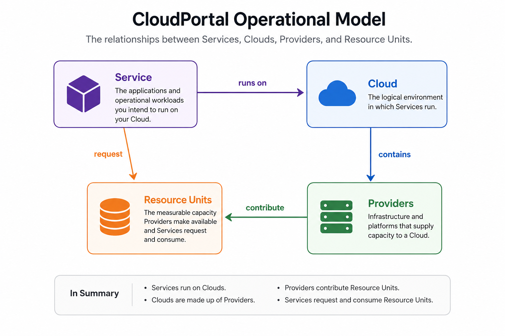

# CloudPortal

## Manage your entire cloud, not just a single provider.

CloudPortal is a provider-independent cloud operations platform.

Whether your cloud is composed of:

- Kubernetes
- Amazon Web Services (AWS)
- Microsoft Azure
- Google Cloud Platform (GCP)
- Proxmox
- VMware
- Bare metal
- Existing, refurbished, surplus, or commodity hardware
- Or any combination of the above

CloudPortal provides a single operational interface for understanding, operating, and growing your cloud.

> **Infrastructure should be described by capability, not implementation.**

## Operational Model

## Core Model

CloudPortal is built around a service-first operational model:

- **Services** are the applications and operational workloads you intend to run on your Cloud.
- **Clouds** are the logical environments in which Services run.
- **Providers** supply capacity to a Cloud.
- **Resource Units** describe both the capacity Providers make available and the capacity Services request and consume.
- **Provider extensions** expose implementation-specific details only when an operator chooses to drill deeper.
